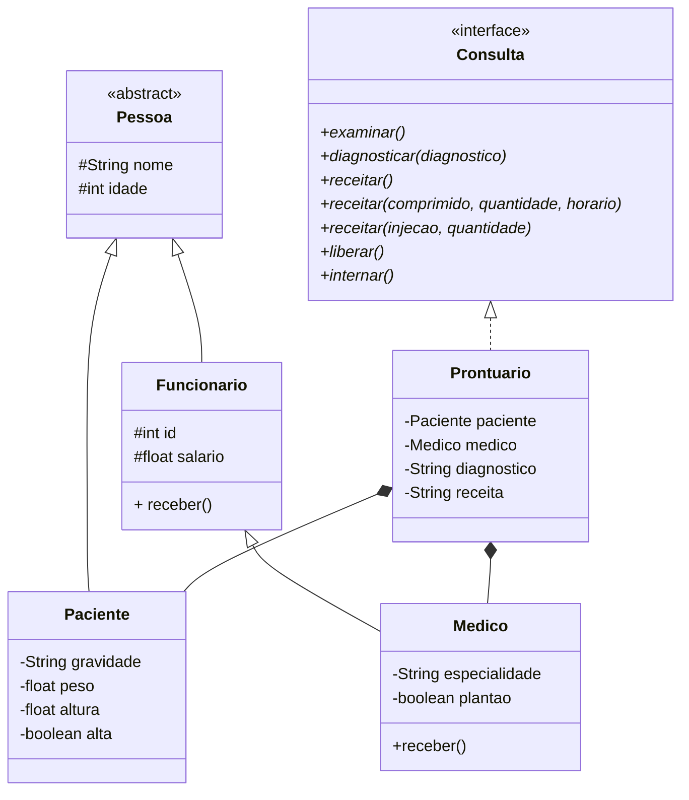

# Programação Orientada a Objetos

Repositório contendo um exemplo de projeto de programação orientada a objetos desenvolvido em Java.

O projeto conta com uma classe abstrata denominada `Pessoa`, duas classes filhas de `Pessoa` denominadas `Paciente` e `Funcionario`, uma classe filha de `Funcionario` denominada `Medico`, assim como uma classe denominada `Prontuario` que implementa uma interface denominada `Consulta`.



## Pessoa

A classe `Pessoa` se trata de uma classe abstrata com os atributos protegidos `nome` e `idade`, assim como seu método construtor e métodos getters e setters.

### Paciente

A classe `Paciente` herda os atributos de `Pessoa` e conta ainda com os atributos privados `gravidade`, `peso`, `altura` e `alta`, assim como seu método construtor e métodos getters e setters.

### Funcionário

A classe `Funcionario` herda os atributos de `Pessoa` e conta ainda com os atributos protegidos `id` e `salario`, assim como seu método construtor e métodos getters e setters.

A classe conta ainda com um método público denominado `receber` que confirma o recebimento do salário no console.

```java
public void receber() {
    System.out.println("Funcionário(a) " + this.nome + " recebeu " + this.salario + " pelo mês corrente.");
}
```

#### Medico

A classe `Medico` herda os atributos e métodos de `Funcionario` e conta ainda com os atributos privados `especialidade` e `plantao`, assim como seu método construtor e métodos getters e setters.

A classe também sobrepõe o método `receber` herdado da classe `Funcionario`, pois o médico recebe o salário por plantão realizado.

```java
@Override
public void receber() {
    System.out.println("Doutor(a) " + this.nome + " recebeu " + this.salario + " pelo plantão realizado.");
}
```


## Consulta

A interface `Consulta` define os métodos utilizados em um ciclo de consulta que inicia com o exame dos sintomas do paciente, segue para o diagnóstico médico, posteriormente é receitado o procedimento necessário ao paciente e é decidido sua alta ou internamento.

### Prontuário

A classe `Prontuario` possui os atributos privados `paciente`, `medico`, `diagnostico` e `receita`, assim como seu método construtor e métodos getters e setters.

A classe conta ainda com a implementação dos métodos da interface `Consulta`.

#### Examinar

O método confirma o início da consulta no console.

```java
@Override
public void examinar() {
    System.out.println("Doutor(a) " + this.medico.nome + ", está examinando o paciente " + this.paciente.nome);
}
```

#### Diagnosticar

O método recebe o diagnóstico médico como parâmetro e o armazena no atributo `diagnostico`.

```java
@Override
public void diagnosticar(String diagnostico) {
	this.setDiagnostico(diagnostico);
}
```

#### Receitar

O método pode ser utilizado de três formas diferentes, sem parâmetros, com um parâmetro `String` e dois parâmetros `int`, assim como com um parâmetro `String` e um parâmetro `int`.

##### `receitar()`

Quando o método é chamado sem parâmetros o atributo `receita` recebe a informação de que o paciente necessita de uma cirurgia.

```java
@Override
public void receitar() {
    this.receita = "Paciente " + this.paciente.nome + " necessita de operação.";
}
```

##### `receitar(String comprimido, int quantidade, int horario)`

Quando o método é chamado com um parâmetro `String` e dois parâmetros `int` o atributo `receita` recebe a informação de que o paciente necessita tomar uma certa quantidade de um comprimido definido em um certo intervalo de tempo.

```java
@Override
public void receitar(String comprimido, int quantidade, int horario) {
    this.receita = "Paciente " + this.paciente.nome + " deve tomar " + quantidade + " comprimido(s) de " + comprimido + " a cada " + horario + " hora(s)";
}
```

##### `receitar(String injecao, int quantidade)`

Quando o método é chamado com um parâmetro `String` e um parâmetro `int`, o atributo `receita` recebe a informação de que o paciente necessita tomar uma certa quantidade de uma injeção definida.

```java
@Override
public void receitar(String injecao, int quantidade) {
    this.receita = "Paciente " + this.paciente.nome + " deve tomar " + quantidade + " ml de " + injecao;
}
```

#### Liberar

O método define o atributo `alta` do paciente para `true`.

```java
@Override
public void liberar() {
    this.paciente.setAlta(true);
}
```

#### Internar

O método define o atributo `alta` do paciente para `false`.

```java
@Override
public void internar() {
    this.paciente.setAlta(false);
}
```


## Referência

Os códigos apresentados nesse repositório partem de estudos iniciados no curso de [POO](https://www.youtube.com/playlist?list=PLHz_AreHm4dkqe2aR0tQK74m8SFe-aGsY) do Prof. Gustavo Guanabara no canal [Curso em Vídeo](https://www.youtube.com/c/CursoemV%C3%ADdeo) no YouTube.
